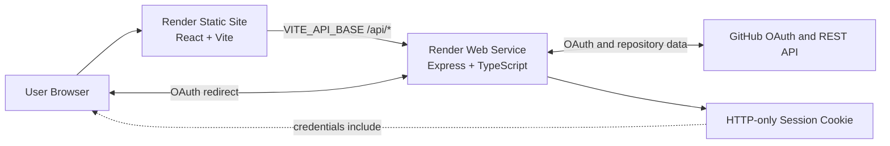

# GitWorld: Explore Your Code as a Living World

## Basic Details

### Team Name

[Add team name]

### Team Members

- Team Lead: Sanjeev Krishna S - Albertian Institute of Science and Technology
- Member 2: Dev Mohan - Albertian Institute of Science and Technology

### Project Description

GitWorld transforms GitHub activity and repository structure into an explorable 2D software town. Users can walk through a personalized world, inspect repositories as spatial buildings, explore repository interiors, view code, discover public GitHub projects, and create new repositories through an in-world construction experience.

The application supports both a no-credentials demo mode and a live GitHub mode using GitHub OAuth. The frontend provides the interactive world, while the backend handles authentication, GitHub API access, sessions, repository inspection, world generation, and user settings.

### The Problem (that doesn't exist)

Developers have a ridiculous problem: their repositories are trapped in flat lists, while their code is clearly begging to become a town with roads, districts, landmarks, rivers, buildings, and mysterious shortcuts.

GitHub tells us what exists, but not what it feels like to move through the history and structure of our software. A repository with hundreds of files and a repository with three files can look almost identical in a conventional dashboard.

### The Solution (that nobody asked for)

GitWorld turns repositories into places. Repository size, activity, language mix, code categories, documentation, tests, and other signals influence the appearance and scale of buildings. Directories become districts and file categories become recognizable areas inside a repository world.

Users can enter demo mode immediately, sign in with GitHub for a personalized world, explore another public GitHub username, open repository interiors, inspect selected files, and use the construction district to create a real GitHub repository when authenticated.

## Technical Details

### Technologies/Components Used

For Software:

- **Languages:** TypeScript, TSX, CSS, JavaScript modules
- **Frontend:** React 19, Vite 8, Zustand
- **Backend:** Node.js, Express 4, TypeScript
- **Authentication:** GitHub OAuth 2.0, HTTP-only cookie sessions
- **External API:** GitHub REST API and GitHub raw file endpoints
- **World generation:** Deterministic TypeScript builders and seeded procedural data
- **Rendering:** 2D canvas-based city and repository world renderers
- **Validation and tooling:** TypeScript compiler, Vite build, Oxlint, npm
- **Deployment target:** Render Static Site for the frontend and Render Web Service for the backend
- **Repository structure:** `gitworld/` contains the frontend; `server/` contains the backend

For Hardware:

GitWorld does not require dedicated hardware. It runs in a modern browser on a laptop or desktop computer. A keyboard is recommended for movement and shortcuts, and touch controls are available where implemented by the frontend.

## Architecture and Deployment Model

This project contains two separately deployable applications:

| Component | Directory | Technology | Render service | Public responsibility |
|---|---|---|---|---|
| Frontend | `gitworld/` | React + Vite | **Static Site** | Serves the compiled browser application from `dist/` |
| Backend | `server/` | Express + TypeScript | **Web Service** | Runs the API, GitHub OAuth flow, sessions, and repository/world endpoints |

### Is the backend a static site?

**No.** The backend is an Express server that listens on a port, processes requests, calls GitHub, creates sessions, and returns JSON. It must run continuously as a Render **Web Service**.

A Render Static Site only serves already-built files such as HTML, JavaScript, CSS, and images. It cannot run `node dist/server.js`, receive OAuth callbacks, maintain the API session flow, or execute the backend routes under `/api`.

The recommended production layout is:

```text
Browser
  |
  | loads the compiled frontend
  v
Render Static Site: gitworld-frontend
  |
  | fetches /api/* using VITE_API_BASE
  v
Render Web Service: gitworld-backend
  |
  | GitHub OAuth, sessions, repository data, world generation
  v
GitHub REST API
```

The frontend currently reads its backend origin from `VITE_API_BASE`, with `http://localhost:5000` as the local-development fallback. In production, `VITE_API_BASE` must point to the deployed backend URL, including `https://` and without a trailing slash.

## Implementation

### For Software

The frontend is a Vite application. The backend is a separately compiled TypeScript Express application.

### Installation

Clone the repository and enter the project directory:

```bash
git clone <your-repository-url>
cd useless_project_temp1
```

Install frontend dependencies:

```bash
cd gitworld
npm install
```

Install backend dependencies:

```bash
cd ../server
npm install
```

### Local environment configuration

Create `server/.env` for local development. Do not commit this file:

```env
PORT=5000
CLIENT_URL=http://localhost:5173
SESSION_SECRET=replace-with-a-long-random-secret
GITHUB_CLIENT_ID=your-github-oauth-client-id
GITHUB_CLIENT_SECRET=your-github-oauth-client-secret
GITHUB_CALLBACK_URL=http://localhost:5000/api/auth/callback
```

The frontend can optionally use a `gitworld/.env.local` file:

```env
VITE_API_BASE=http://localhost:5000
```

`VITE_*` variables are embedded into the browser bundle. Never put a GitHub client secret, session secret, or other private credential in a frontend environment variable.

### Run locally

Start the backend in one terminal:

```bash
cd server
npm run dev
```

The backend listens on `http://localhost:5000` by default. Verify it with:

```bash
curl http://localhost:5000/api/health
```

Start the frontend in a second terminal:

```bash
cd gitworld
npm run dev
```

Open the Vite URL shown in the terminal, normally `http://localhost:5173`.

### Build and preview locally

Build the frontend:

```bash
cd gitworld
npm run build
```

The production frontend is written to `gitworld/dist`.

Build the backend:

```bash
cd ../server
npm run build
```

The compiled backend is written to `server/dist`. Start the compiled backend with:

```bash
npm start
```

Run the frontend lint command with:

```bash
cd ../gitworld
npm run lint
```

## Render Deployment Guide

Deploy the frontend and backend as two Render services from the same repository.

### 1. Deploy the backend as a Render Web Service

In Render, choose **New + → Web Service**, connect the GitHub repository, and use these settings:

| Setting | Value |
|---|---|
| Root Directory | `server` |
| Runtime | Node |
| Build Command | `npm install && npm run build` |
| Start Command | `npm start` |
| Health Check Path | `/api/health` |
| Auto-deploy | Recommended |

The backend already uses `process.env.PORT`, which is required because Render supplies the listening port dynamically. Do not hard-code a production port in the Render service.

Add these backend environment variables in Render. Use the actual frontend and backend URLs after the services exist:

```env
NODE_ENV=production
CLIENT_URL=https://<frontend-service>.onrender.com
SESSION_SECRET=<long-random-production-secret>
GITHUB_CLIENT_ID=<github-oauth-client-id>
GITHUB_CLIENT_SECRET=<github-oauth-client-secret>
GITHUB_CALLBACK_URL=https://<backend-service>.onrender.com/api/auth/callback
```

`PORT` normally does not need to be entered manually because Render provides it. If it is entered, the application still gives precedence to the Render-provided value.

After deployment, verify:

```text
https://<backend-service>.onrender.com/api/health
```

A successful response should contain a JSON object with `status: "ok"`.

### 2. Deploy the frontend as a Render Static Site

In Render, choose **New + → Static Site**, connect the same repository, and use these settings:

| Setting | Value |
|---|---|
| Root Directory | `gitworld` |
| Build Command | `npm install && npm run build` |
| Publish Directory | `dist` |
| Auto-deploy | Recommended |

Set the frontend environment variable before the first production build:

```env
VITE_API_BASE=https://<backend-service>.onrender.com
```

Because Vite embeds `VITE_API_BASE` during the build, trigger a new frontend deploy whenever this value changes.

### 3. Configure GitHub OAuth

In the GitHub OAuth App settings, set the callback URL to exactly:

```text
https://<backend-service>.onrender.com/api/auth/callback
```

The callback URL must use the deployed backend URL, not the frontend URL. The backend receives the OAuth callback, creates the HTTP-only session cookie, and redirects the user back to the frontend.

The backend CORS configuration uses `CLIENT_URL` as its allowed origin and enables credentials. Therefore:

- `CLIENT_URL` must be the exact frontend origin.
- Do not add a trailing slash unless the deployed origin itself requires it.
- The frontend API calls must use the exact backend origin in `VITE_API_BASE`.
- The browser must be allowed to send credentials with `credentials: 'include'`.
- If either URL is wrong, login and session requests will usually fail with a CORS or redirect error.

### 4. Optional Render Blueprint

A `render.yaml` can be added later to describe both services as infrastructure-as-code. The current project does not include one, so the dashboard configuration above is the direct deployment path.

A blueprint would need two services: a Node Web Service rooted at `server` and a Static Site rooted at `gitworld`. Secrets such as `SESSION_SECRET` and `GITHUB_CLIENT_SECRET` should be supplied through Render environment groups or the Render dashboard, not committed to Git.

## Backend API Overview

The Express backend exposes these route groups:

| Route | Purpose |
|---|---|
| `GET /api/health` | Render health check and server status |
| `/api/auth` | GitHub login, callback, session lookup, mock login, and logout |
| `/api/world` | Personal and public world data |
| `/api/repos` | Repository lists, repository trees, file content, and repository creation |
| `/api/user` | Developer profile and RPG-style statistics |
| `/api/settings` | Game settings and preferences |

The frontend first attempts to use the backend for live data and can fall back to public GitHub endpoints or local demo data for selected read-only exploration flows. Authentication, private repository access, sessions, and repository creation still require the backend.

## Security and Production Checklist

The current local `server/.env` contains credentials and must be treated as compromised if it has ever been committed, uploaded, or shared. Before deploying:

1. Rotate the GitHub OAuth client secret in GitHub Developer Settings.
2. Generate a new strong production `SESSION_SECRET`.
3. Remove `server/.env` from Git history if it was committed.
4. Confirm `.gitignore` excludes local environment files.
5. Add only production values to Render's secret environment settings.
6. Never expose `GITHUB_CLIENT_SECRET` or `SESSION_SECRET` to the frontend.
7. Use HTTPS URLs for both Render services and the GitHub callback.
8. Confirm that private repository data is not logged or returned to unauthorised users.
9. Test logout, expired sessions, denied OAuth access, GitHub API rate limits, and backend downtime.
10. Check the backend health endpoint after every deployment.

The backend uses secure cookies when `NODE_ENV=production` and trusts the Render reverse proxy. This is appropriate for the deployed HTTPS setup, but production behavior should still be tested in a real browser because cookie and cross-origin behavior depends on the final domains.

## Project Documentation

### For Software

### Screenshots

Add at least three final screenshots before submission. Suggested captures are:


*Landing screen showing the GitWorld concept, demo entry point, GitHub sign-in action, and username exploration.*


*Personal or demo town showing the avatar, roads, districts, repository buildings, and world HUD.*


*Repository interior showing spatial code categories, entry points, file selection, and the code viewer.*

If these files are not present yet, replace the paths above with the final committed screenshot paths. Do not leave placeholder links in the final submission.

### Diagrams



*GitWorld separates static asset delivery from dynamic API execution. The frontend is served by a Render Static Site, while the backend is a Render Web Service that communicates with GitHub and manages the session cookie.*

### For Hardware

No circuit, schematic, or physical build is required for this software project.

## Project Demo

### Video

[Add the final demo video link here]

*The demo should show entering demo mode, walking through the town, selecting a repository, entering the repository interior, inspecting a file, and—if configured—logging in with GitHub and loading live repository data.*

### Additional Demos

- Frontend production URL: `https://<frontend-service>.onrender.com`
- Backend health URL: `https://<backend-service>.onrender.com/api/health`
- Source repository: [Add repository URL]
- Deployment notes: this README

## Team Contributions

- [Name 1]: Product concept, world layout, frontend interaction design, and integration.
- [Name 2]: Backend API, GitHub OAuth, repository data services, and Render deployment.
- [Name 3]: Visual design, testing, demo preparation, documentation, and presentation.

Update these entries with the actual contributions of each team member before submission.

---

Made with ❤️ at TinkerHub Useless Projects


